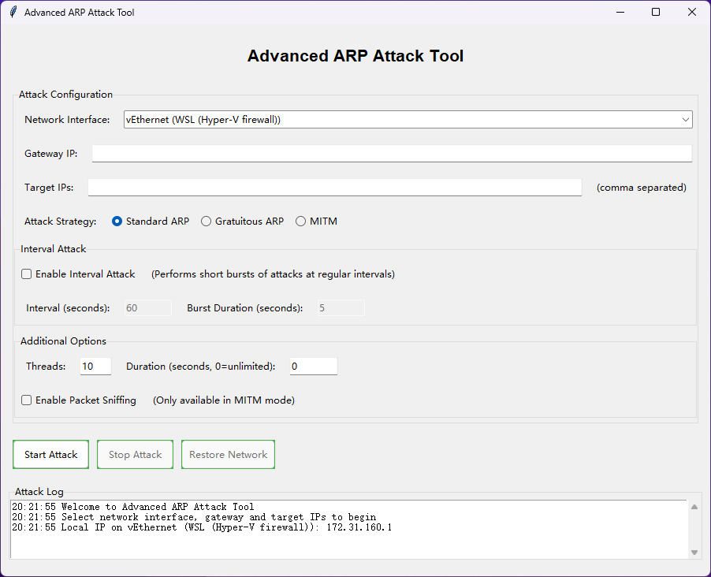

[](README_zh.md)
## GUI interface usage
### Attack Configuration:
- `Network Interface`: Network interface selection
- `Gateway IP`: Gateway IP input
- `Target IPs`: Target IP input (use commas to separate multiple attack targets)
- `Attack Strategy`: Attack strategy selection
- `Interval Attack`: Intermittent attack selection
- `Threads`: Thread Settings
- `Duration(sec)`: Thread setting duration setting (seconds)
- `Packet Sniffing`: Packet Sniffing Selection

### GUI interface:

---

### Build the code files into an .exe file
Build the application as an executable using PyInstaller:

**1. Install PyInstaller:**
```shell
$ pip install pyinstaller
```
**2. Create an executable file:**
```shell
$ pyinstaller --onefile --windowed --icon=network.ico --name="ARP_Attack_Tool" arp_attack_GUI.py
```
Option description:
- `--onefile`: Creating a single executable file
- `--windowed`: Prevent the console window from appearing when the application is running
- `--icon=network.ico`: (Optional) Add an icon for the executable (you will need a .ico file)
- `--name="ARP_Attack_Tool"`: Naming the executable file

**3. Find the executable file:** After PyInstaller finishes, you will find the executable in the dist folder that PyInstaller created.

#### Important Notes
1. **Administrator privileges:** Since ARP spoofing requires administrator privileges, you will need to run the executable as an administrator on Windows or with sudo on Linux.
2. **Dependency handling:** PyInstaller will try to include all dependencies, but you may need to make adjustments for some libraries. Scapy in particular may require special handling.
3. **Antivirus detection:** Network manipulation tools may trigger antivirus software. You may need to add exceptions for executable files.

#### Advanced PyInstaller Configuration
For finer control, you can create a PyInstaller spec file:
1. Generate spec file:
```shell
pyi-makespec --onefile --windowed --icon=network.ico --name="ARP_Attack_Tool" arp_attack_GUI.py
```
2. **Editing the spec file** to add any hidden imports or special resources
3. **Build using the spec file:**
```shell
pyinstaller ARP_Attack_Tool.spec
```

#### To enhance performance
You can also use the `--noupx` flag to avoid UPX compression, which can be problematic for network tools:
```python
pyinstaller --onefile --windowed --noupx --icon=network.ico --name="ARP_Attack_Tool" arp_attack_GUI.py
```

#### Create a shortcut
On Windows, you can create a shortcut to the executable that runs as administrator:
1. Right-click on the executable file and select "Create Shortcut"
2. Right-click the shortcut and select Properties
3. Click "Advanced..." and check "Run as administrator"
4. Click OK, then Apply
This shortcut will now prompt for administrator privileges when used.

#### Final Notes
Keep in mind that ARP spoofing techniques should only be performed on networks that you own or have explicit permission to test. In most jurisdictions, it is illegal to use these techniques on an unauthorized network.