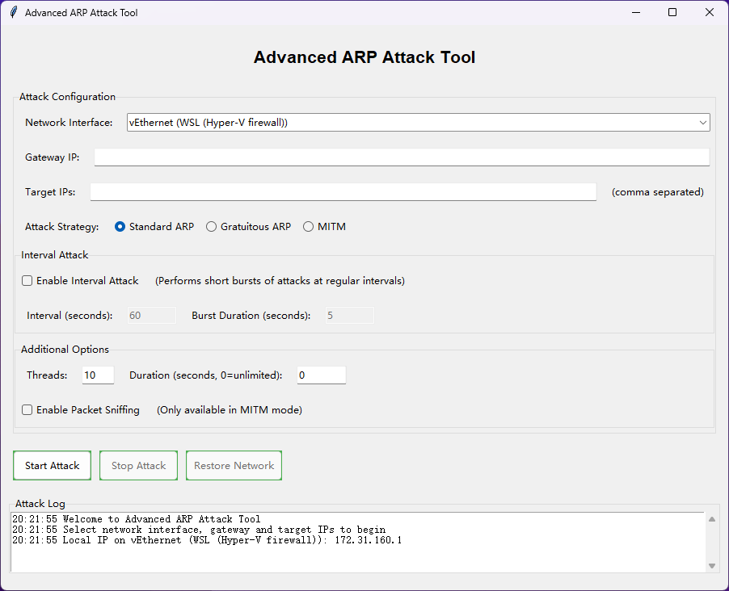

[](README.md)
## GUI 界面使用
### 攻击配置:
- `Network Interface`: 网络接口选择
- `Gateway IP`: 网关IP输入
- `Target IPs`: 目标IP输入(多个攻击目标使用逗号分隔)
- `Attack Strategy`: 攻击策略选择
- `Interval Attack`: 间歇攻击选择
- `Threads`: 线程设置
- `Duration(sec)`: 持续时间设置(秒)
- `Packet Sniffing`: 数据包嗅探选择

### GUI 界面:

---

### 将代码文件构建为 .exe 文件
使用 PyInstaller 将应用程序构建为可执行文件：

**1. 安装 PyInstaller：**
```shell
$ pip install pyinstaller
```
**2. 创建可执行文件：**
```shell
$ pyinstaller --onefile --windowed --icon=network.ico --name="ARP_Attack_Tool" arp_attack_GUI.py
```
选项说明：
- `--onefile`：创建单个可执行文件
- `--windowed`：阻止应用程序运行时出现控制台窗口
- `--icon=network.ico`：（可选）为可执行文件添加图标（您需要一个 .ico 文件）
- `--name="ARP_Attack_Tool"`：为可执行文件命名

**3. 查找可执行文件：** PyInstaller 完成后，您将在 PyInstaller 创建的 dist 文件夹中找到可执行文件。

#### 重要注意事项
1. **管理员权限：** 由于 ARP 欺骗需要管理员权限，因此您需要在 Windows 上以管理员身份运行可执行文件，或在 Linux 上使用 sudo 运行。
2. **依赖项处理：** PyInstaller 将尝试包含所有依赖项，但您可能需要对某些库进行调整。尤其是 Scapy，可能需要特殊处理。
3. **防病毒检测：** 网络操控工具可能会触发防病毒软件。您可能需要为可执行文件添加例外。

#### 高级 PyInstaller 配置
为了更好地控制，您可以创建 PyInstaller spec 文件：
1. 生成 spec 文件：
```shell
pyi-makespec --onefile --windowed --icon=network.ico --name="ARP_Attack_Tool" arp_attack_GUI.py
```
2. **编辑 spec 文件**以添加任何隐藏的导入或特殊资源
3. **使用 spec 文件构建：**
```shell
pyinstaller ARP_Attack_Tool.spec
```

#### 为了增强性能
您还可以使用 `--noupx` 标志来避免 UPX 压缩，这对于网络工具来说可能会有问题：
```python
pyinstaller --onefile --windowed --noupx --icon=network.ico --name="ARP_Attack_Tool" arp_attack_GUI.py
```

#### 创建快捷方式
在 Windows 上，您可以创建以管理员身份运行的可执行文件的快捷方式：
1. 右键单击可执行文件，然后选择“创建快捷方式”
2. 右键单击快捷方式，然后选择“属性”
3. 点击“高级...”并检查“以管理员身份运行”
4. 点击“确定”，然后点击“应用”
此快捷方式现在会在使用时提示需要管理员权限。

#### 最后说明
请记住，ARP 欺骗技术只能在您拥有或拥有明确测试权限的网络上进行。在大多数司法管辖区，在未经授权的网络上使用这些技术都是违法的。